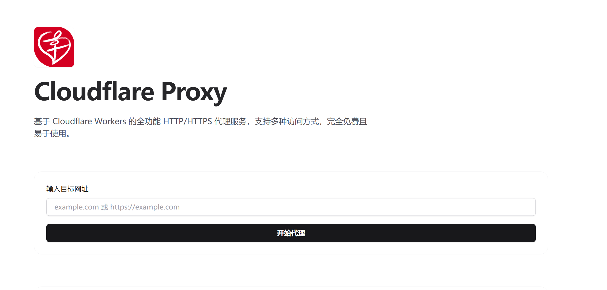

# Cloudflare Proxy (Customized Version)

> 基于 Cloudflare Workers 的全功能 HTTP/HTTPS 代理服务（增强版）

[](https://deploy.workers.cloudflare.com/?url=https://github.com/lemodragon/cloudflare-proxy)

这是一个定制化的 Cloudflare Workers 代理脚本，在原版基础上增加了**域名白名单控制**和**自动引流/跳转**功能。

## ✨ 新增特性

- 🛡️ **白名单控制** - 支持通过环境变量配置允许访问的域名，未授权域名将被拒绝访问。
- 📢 **自动引流** - Web 界面访问 10 秒后自动跳转至指定演示站（支持后台运行不影响代理使用）。
- 🖼️ **自定义 UI** - 集成了自定义 Logo 图标，点击标题或 Logo 可直接跳转。

## 🚀 核心特性

- 🌐 **多种访问方式** - Web 界面、查询参数、路径方式、标准 HTTP 代理
- 🔒 **HTTPS 支持** - 完整支持 HTTPS 网站代理
- 🔄 **智能重定向** - 自动处理 301/302 等重定向
- 🛠️ **路径修复** - 自动修复 HTML 中的相对路径
- 🌍 **CORS 支持** - 完整的跨域资源共享支持
- 📱 **响应式设计** - 完美适配移动端和桌面端
- ⚡ **零成本运行** - Cloudflare Workers 免费版每天 10 万次请求

## 页面展示



> **注意**：Web 界面包含自定义 Logo，且页面加载 10 秒后会自动跳转至演示站点。

## ⚙️ 配置说明 (重要)

本版本依赖环境变量来控制白名单功能。部署后请务必进行以下配置：

### 1. 设置白名单 (WHITELIST)

如果不设置此变量，代理将默认**允许访问所有网站**。如果设置了此变量，只有列表中的域名（及其子域名）允许被代理。

1.  登录 Cloudflare Dashboard。
2.  进入你的 Worker 项目 -> **Settings** -> **Variables and Secrets**。
3.  点击 **Add** 添加变量：
    -   **Variable name**: `WHITELIST`
    -   **Value**: 你的允许域名列表，用逗号分隔。
    -   *示例*: `github.com, raw.githubusercontent.com, google.com`
4.  点击 **Deploy** 保存。

### 2. 引流与跳转配置

代码中硬编码了引流逻辑：
- **跳转目标**: `https://demo.lvdpub.com`
- **Logo 图片**: `https://demo-cloudflare-imgbed.pages.dev/file/f8fd26c6eff4c2e26b824.png`
- **跳转时间**: 10 秒
- *如需修改这些设置，请直接编辑 `worker.js` 代码中的 `getRootHtml` 函数部分。*

## 📦 安装方式

### 方式一：一键部署（推荐）

点击上方 "Deploy to Cloudflare Workers" 按钮，按照提示完成部署。

### 方式二：使用 Wrangler CLI

```bash
# 1. 安装 Wrangler
npm install -g wrangler

# 2. 登录 Cloudflare
wrangler login

# 3. 克隆仓库 (请使用修改后的代码覆盖 worker.js)
git clone [https://github.com/lemodragon/cloudflare-proxy.git](https://github.com/lemodragon/cloudflare-proxy.git)
cd cloudflare-proxy

# 4. 部署
wrangler deploy

```

### 方式三：使用 Cloudflare Dashboard

1. 登录 [Cloudflare Dashboard](https://dash.cloudflare.com/)
2. 进入 **Workers & Pages**
3. 点击 **Create Application** > **Create Worker**
4. 将定制后的 `worker.js` 代码完整复制粘贴到编辑器
5. 点击 **Save and Deploy**
6. **别忘了配置环境变量 `WHITELIST`**

## 📖 使用方式

### 方式 1: Web 界面 (含引流功能)

直接访问你的 Worker URL，在网页界面输入目标网址：

```
https://$YOUR-PROXY-DOMAIN/

```

> **提示**：在该页面停留 10 秒会自动跳转到演示站。建议输入网址后点击“开始代理”，代理页面会在**新标签页**打开，不受原标签页跳转影响。

### 方式 2: 查询参数

在 URL 后添加 `?url=` 参数：

```bash
https://$YOUR-PROXY-DOMAIN/?url=[https://example.com](https://example.com)

```

### 方式 3: 路径方式

直接在路径中指定目标网址：

```bash
# 完整 URL（带协议）
https://$YOUR-PROXY-DOMAIN/[https://example.com](https://example.com)

# 简写（自动添加 https://）
https://$YOUR-PROXY-DOMAIN/example.com

```

### 方式 4: HTTP 代理

设置为系统代理，适用于命令行工具：

```bash
# Linux/macOS
export HTTP_PROXY=https://$YOUR-PROXY-DOMAIN
export HTTPS_PROXY=https://$YOUR-PROXY-DOMAIN

# Windows (PowerShell)
$env:HTTP_PROXY="https://$YOUR-PROXY-DOMAIN"
$env:HTTPS_PROXY="https://$YOUR-PROXY-DOMAIN"

# 使用代理访问
curl [https://api.github.com](https://api.github.com)

```

## 💡 使用场景

### 1. GitHub 文件加速

加速 raw.https://www.google.com/search?q=githubusercontent.com 文件下载（**需将 https://www.google.com/search?q=githubusercontent.com 加入白名单**）：

```bash
# 使用代理（加速访问）
https://$YOUR-PROXY-DOMAIN/[https://raw.githubusercontent.com/user/repo/main/file.txt](https://raw.githubusercontent.com/user/repo/main/file.txt)

```

### 2. Docker 镜像加速

配置 Docker 镜像代理源（**需将 docker.io 加入白名单**）：

```bash
# 在 /etc/docker/daemon.json 中配置
{
  "registry-mirrors": [
    "https://$YOUR-PROXY-DOMAIN/[https://registry-1.docker.io](https://registry-1.docker.io)"
  ]
}

```

### 3. OpenAI API 代理

代理 OpenAI API 请求（**需将 openai.com 加入白名单**）：

```javascript
const openai = new OpenAI({
  baseURL: "https://$YOUR-PROXY-DOMAIN/[https://api.openai.com/v1](https://api.openai.com/v1)",
  apiKey: "your-api-key",
});

```

### 4. 前端 CORS 代理

解决前端跨域问题：

```javascript
// 使用代理解决 CORS
fetch("https://$YOUR-PROXY-DOMAIN/[https://api.example.com/data](https://api.example.com/data)")
  .then((res) => res.json())
  .then((data) => console.log(data));

```

## ⚠️ 注意与提醒

### 🚨 重要提示

1. **白名单机制**
* 开启白名单后，访问未授权的域名会返回 `403 Access Denied` 错误。
* 请确保将所有依赖的子域名（如 CDN 域名）也加入白名单，或直接添加主域名（如 `google.com` 会自动匹配 `api.google.com`）。


2. **引流跳转**
* Web 界面的自动跳转仅在访问根路径 `/` 时触发。
* 直接通过 API 或路径代理访问资源（如 `/https://google.com`）**不会**触发跳转，不影响业务逻辑。


3. **使用自定义域名**
* Cloudflare 默认的 `*.workers.dev` 域名在某些地区可能无法访问，建议绑定自定义域名。


### 🔒 安全配置

虽然本项目提供了白名单功能，但建议根据需要进一步增强安全性，例如添加 API Key 验证（需自行修改代码）。

## 免责声明

本项目仅供学习和研究使用，使用者需遵守以下规定：

1. **合法使用** - 仅用于访问合法内容，不得用于访问违法或侵权内容
2. **服务条款** - 使用时需遵守 Cloudflare Workers 服务条款
3. **责任自负** - 使用本代理产生的任何后果由使用者自行承担
4. **商业用途** - 如需商业使用，请确保符合相关法律法规

## 常见问题

### Q: 为什么提示 "Domain is not in the whitelist"?

A: 你配置了环境变量 `WHITELIST`，但当前访问的域名不在列表中。请去 Cloudflare 后台添加该域名。

### Q: 10秒跳转会打断我的代理访问吗？

A: 不会。Web 界面的代理请求是使用 `window.open` 在**新标签页**打开的。原标签页的跳转不会关闭或影响新打开的代理页面。

### Q: 可以代理 WebSocket 吗？

A: 不可以。Cloudflare Workers 目前不支持 WebSocket 连接。

## 许可证

[GPL-3 License](https://www.google.com/search?q=LICENSE)

---

**如果这个项目对你有帮助，请在 [GitHub](https://github.com/lemodragon/cloudflare-proxy) 上给我们一个 ⭐️**
